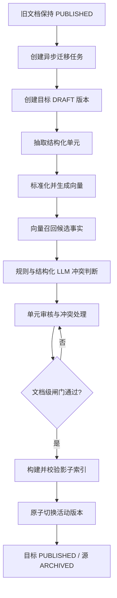

# 旧文档结构化迁移与事实冲突检测设计

## 1. 背景与目标

系统需要将已有的非结构化知识文档清洗为结构化知识单元，同时处理不同文档中“问题大意相同但答案不一致”的情况。迁移期间不能影响线上问答，迁移完成后也不能出现同一知识集的新旧内容同时生效或部分生效。

本方案采用“异步整文档迁移 + 向量召回 + 事实冲突判断 + 人工审核 + 文档版本原子切换”。旧文档保留并可回滚，不做物理删除。

### 1.1 目标

- 对整份文档建立可重试、可观测、可审计的异步迁移任务。
- 将文档内容抽取为带证据的结构化事实，并生成向量。
- 召回语义相近的旧事实，识别真实事实冲突，区分适用范围差异。
- 第一版即使没有检测到冲突，也必须经过人工确认。
- 在所有审核、冲突处理和索引校验完成后，整份文档一次性切换。
- 任一步骤失败时保持旧文档在线，并支持重试和回滚。

### 1.2 非目标

- 不在本阶段实现跨知识集的全局真值裁决。
- 不让大模型直接决定高风险事实或自动发布内容。
- 不通过逐条发布、原地覆盖或删除旧文档来完成迁移。
- 不重建现有的结构化知识人工审核能力，而是在其上增加迁移和文档级控制。

## 2. 现状与改造点

现有代码已经包含以下能力：

- `StructuredKnowledgeExtractionService` 可抽取结构化事实和向量，并以 `DRAFT` 持久化。
- `BotKnowledgeSemanticUnit` 已包含问题、陈述、意图、实体、条件、排除条件、证据和置信度等字段。
- `StructuredKnowledgeUnitReviewService` 可将单元从 `DRAFT` 审核为 `APPROVED`。
- `QuestionClusteringService` 已使用 embedding 和余弦相似度做问题聚类。
- `KnowledgeDocumentReleaseService` 已具备文档版本和归档能力。

当前的关键问题是：单元审批后会立即同步结构化索引，而索引主要按单元 `APPROVED` 状态加载，没有强制校验所属文档是否为活动版本。这允许新文档部分单元提前上线，必须改为文档级生效闸门。

## 3. 总体架构

### 3.1 组件边界

1. **MigrationJobService**
   - 创建任务、校验幂等键、推进状态、记录进度和错误、发起重试。
2. **MigrationWorker**
   - 异步执行抽取、标准化、向量化、召回、冲突检查和影子索引构建。
   - 每一步可独立重试，写入必须幂等。
3. **FactNormalizationService**
   - 统一文本、同义词、数字、单位、日期、时区、枚举和范围表达。
4. **FactConflictService**
   - 先规则比较，后对边界候选调用结构化 LLM 判断，持久化证据和结果。
5. **StructuredKnowledgeUnitReviewService**
   - 复用现有单元人工审核，并将迁移任务上下文展示给审核人。
6. **MigrationReviewService**
   - 提供冲突处理和文档级“确认可切换”操作。
7. **StructuredKnowledgeUnitIndexService**
   - 只索引当前活动文档版本的 `APPROVED` 单元；支持影子索引和版本化读取。
8. **KnowledgeDocumentReleaseService**
   - 执行文档版本原子切换、归档旧版本和回滚。

### 3.2 版本模型

目标版本与源文档使用相同的 `knowledgeSetKey`，但拥有独立的文档版本 ID。迁移期间目标版本为 `DRAFT`，其单元可以是 `DRAFT` 或 `APPROVED`，但均不可被线上检索。只有文档被切换为活动版本后，单元才有资格进入线上索引。

线上检索先获取一次 `knowledgeSetKey -> activeDocumentVersionId` 快照，再基于该版本查询，避免一次问答混入新旧版本。

## 4. 任务状态与数据流



任务状态：

```text
PENDING
  -> EXTRACTING
  -> EMBEDDING
  -> CONFLICT_CHECKING
  -> REVIEW_REQUIRED
  -> READY_TO_SWITCH
  -> SWITCHING
  -> COMPLETED
```

任意状态可转为 `FAILED`；源文档被修改时转为 `STALE`，不可继续切换。`FAILED` 任务只能通过显式重试回到对应步骤；`COMPLETED`、`STALE` 不可重复执行切换。

### 4.1 每个阶段的输入和输出

- **EXTRACTING**：读取源文档快照，调用现有抽取服务，写入目标版本的结构化单元和原文证据。
- **EMBEDDING**：为问题、陈述和意图生成向量，记录模型版本、维度和生成时间。
- **CONFLICT_CHECKING**：对每个候选单元执行精确归一化匹配、向量召回和事实比较，写入冲突记录。
- **REVIEW_REQUIRED**：审核所有结构化单元和冲突记录；零冲突也必须人工确认。
- **READY_TO_SWITCH**：执行文档级闸门校验，生成可切换快照。
- **SWITCHING**：构建影子索引、校验完整性，然后在锁和事务保护下切换活动版本。

## 5. 向量召回与事实冲突判断

### 5.1 候选召回

向量召回只负责发现潜在相关事实，不直接得出冲突结论。

1. 先对问题和陈述做精确标准化：去除无意义标点和空白，统一全半角、数字格式、单位、日期和同义词。
2. 使用问题、陈述、意图的 embedding 召回候选，初始取 `topK=20`；最终阈值通过离线标注集校准，不复用问题聚类的 `0.82` 作为冲突阈值。
3. 候选范围限定在相同 `knowledgeSetKey`、产品、渠道、客户类型、地区和有效期重叠的文档/单元内。
4. 对召回结果使用实体和关键词交集做二次过滤，减少仅语境相似但主题不同的候选。
5. 对源版本与目标版本都保留检索模型和参数，保证结果可复现。

### 5.2 事实比较维度

规则引擎优先比较以下字段：

- **极性**：允许/不允许、支持/不支持、必须/无需。
- **数值**：金额、数量、比例、上下限、费率。
- **时间**：生效日、截止日、办理时长、冷静期、有效期。
- **枚举**：渠道、材料类型、支付方式、状态和处理结果。
- **流程**：办理步骤、前置条件、审批顺序和所需材料。
- **范围**：产品、地区、渠道、用户类型、版本和有效期。

比较时先判断适用范围关系：

- 范围相同或重叠且结论不可同时成立：真实冲突。
- 范围互斥：不视为冲突，保留各自适用条件。
- 范围未知或无法比较：标记为待人工确认，不自动放行。

### 5.3 LLM 边界判断

仅将规则无法确定的候选发送给 LLM。输入包括两条结构化事实、适用条件和原文证据；输出固定 JSON：

```json
{
  "relation": "CONFLICT | NOT_CONFLICT | SCOPE_DIFFERENCE | UNKNOWN",
  "conflictType": "POLARITY | NUMERIC | DATE | DURATION | ENUM | PROCESS | SCOPE | OTHER",
  "severity": "BLOCKING | WARNING | INFO",
  "explanation": "...",
  "evidence": ["source fragment 1", "target fragment 2"],
  "confidence": 0.0
}
```

解析失败、证据不足或置信度低于配置阈值时统一按 `UNKNOWN + BLOCKING` 处理，进入人工审核。LLM 不得直接改变单元状态或调用发布接口。

### 5.4 冲突分级

- **BLOCKING**：金额、期限、资格、否定/肯定、强制材料和流程等可能导致错误答复的冲突；未解决不得切换。
- **WARNING**：表述不一致但可能不影响结论，必须人工确认是否合并或保留。
- **INFO**：重复、轻微措辞差异或可追溯性提示，不单独阻止切换，但仍保留审计记录。

## 6. 人工审核与文档级生效闸门

继续使用现有结构化单元审核页面和服务，新增以下迁移上下文：

- 源文档证据和目标结构化事实并排展示。
- 召回候选、相似度、冲突类型、范围关系和判断依据可展开查看。
- 冲突处理方式：采用新事实、保留旧事实、合并、拆分适用范围、判定无冲突。
- 所有处理动作记录处理人、时间、说明和前后值。

文档级“确认可切换”只有在以下条件全部满足时可执行：

1. 目标文档所有结构化单元均已审核；
2. 保留单元为 `APPROVED`，舍弃单元有原因且通过覆盖校验；
3. 所有 `BLOCKING` 和 `WARNING` 冲突均已处理；
4. 源文档内容哈希仍与任务创建时一致；
5. 影子索引构建前置检查通过；
6. 第一版迁移已有明确人工确认记录，即使冲突数为零。

单元 `APPROVED` 只表示内容审核通过，不表示线上生效。单元审批接口不得再触发无条件的线上索引同步，只能更新影子索引或等待文档切换。

## 7. 数据模型

### 7.1 `bot_knowledge_migration_job`

核心字段：

- `id`
- `source_document_id`, `source_version_id`
- `target_document_id`, `target_version_id`
- `knowledge_set_key`
- `source_content_hash`
- `status`, `current_step`, `progress_total`, `progress_done`
- `retry_count`, `last_error_code`, `last_error_message`
- `worker_id`, `lock_version`
- `created_by`, `reviewed_by`, `reviewed_at`, `switch_at`
- `created_at`, `updated_at`

约束与索引：

- 唯一约束：`(source_document_id, source_content_hash, target_version_id)`；同一源快照不能重复创建活动任务。
- 索引：`(knowledge_set_key, status)`、`(status, updated_at)`。
- 状态变更必须带 `lock_version`，防止重复消费和并发切换。

### 7.2 `bot_knowledge_conflict`

核心字段：

- `id`, `migration_job_id`
- `target_unit_id`, `candidate_unit_id`
- `similarity`, `retrieval_model`, `retrieval_params`
- `scope_relation`, `conflict_type`, `severity`
- `source_evidence`, `target_evidence`
- `rule_result`, `llm_result`, `llm_model`
- `status`: `PENDING | RESOLVED | NOT_CONFLICT`
- `resolution`, `resolution_note`
- `reviewed_by`, `reviewed_at`, `created_at`, `updated_at`

对 `(migration_job_id, target_unit_id, candidate_unit_id)` 建唯一约束，保证重复重试不会生成重复冲突。

## 8. 索引、原子切换与回滚

### 8.1 索引读取闸门

结构化索引查询必须同时满足：

- 单元状态为 `APPROVED`；
- 所属文档版本是 `PUBLISHED`；
- 所属文档版本等于该 `knowledgeSetKey` 的活动版本；
- 单元未被标记为删除、过期或超出适用范围。

索引启动加载和增量同步都使用同一过滤条件，不能只在启动加载时过滤。

### 8.2 影子索引校验

切换前为目标版本生成独立影子索引，至少校验：

- 目标版本应上线单元数与索引单元数一致；
- 每个单元向量维度、模型版本和内容哈希正确；
- 所有证据引用可回溯到目标文档；
- 查询冒烟集的召回结果只来自目标版本；
- 索引构建完成且可被健康检查读取。

### 8.3 原子切换

使用 `knowledgeSetKey` 级分布式锁和数据库乐观锁。切换事务内完成：

1. 再次校验源内容哈希、任务状态和文档级闸门；
2. 将活动版本指针切换到目标版本；
3. 将目标文档版本改为 `PUBLISHED`；
4. 将源文档版本改为 `ARCHIVED`；
5. 将任务改为 `COMPLETED`。

线上请求只读取活动版本快照，因此不会在一次请求内跨版本。旧文档和旧索引在配置的回滚保留期内不删除。回滚执行反向版本切换并记录审计事件，不能直接修改已发布单元内容。

## 9. 异步执行、幂等和故障处理

- 任务创建后由队列投递；worker 领取任务时设置租约和心跳。
- 每一步使用任务 ID、步骤名和源内容哈希作为幂等键。
- worker 超时或进程崩溃后，租约过期，任务可被其他 worker 重新领取。
- 外部模型、向量服务和索引服务调用采用超时、有限重试和指数退避。
- 不可重试错误（源文档损坏、格式不支持、哈希过期）直接进入 `FAILED` 或 `STALE`，保留可诊断信息。
- 任何失败都不改变当前活动版本；只有切换事务成功后才认为迁移完成。

## 10. 管理端与服务接口

建议增加以下接口，具体 URL 遵循现有管理端命名规范：

- `POST /knowledge/migrations`：按源文档创建迁移任务。
- `GET /knowledge/migrations/{id}`：查询状态、进度、错误和阻断原因。
- `POST /knowledge/migrations/{id}/retry`：从失败步骤重试。
- `GET /knowledge/migrations/{id}/conflicts`：分页查询冲突及证据。
- `POST /knowledge/migrations/{id}/conflicts/{conflictId}/resolve`：提交冲突处理结果。
- `POST /knowledge/migrations/{id}/review/confirm`：记录文档级人工确认。
- `POST /knowledge/migrations/{id}/switch`：执行影子索引校验和原子切换。
- `POST /knowledge/sets/{knowledgeSetKey}/rollback`：回滚到指定历史版本。

最终切换按钮必须返回明确的阻断原因，而不是只返回“状态不允许”。

## 11. 权限、审计与可观测性

权限至少区分：迁移任务操作、结构化单元审核、冲突处理、最终发布和回滚。所有状态迁移、冲突决策、人工确认、切换和回滚写入审计日志，包含操作者、时间、源/目标版本和原因。

监控指标包括：各阶段耗时、队列等待时间、抽取失败率、向量服务失败率、候选数量、冲突率、未知判断率、人工处理时长、影子索引失败率、切换成功率和回滚次数。日志使用 `migrationJobId`、`knowledgeSetKey` 和版本 ID 关联全链路。

## 12. 测试方案

### 12.1 单元测试

- 文本、数字、单位、日期和范围标准化。
- 极性、数值、时间、枚举、流程和范围比较。
- 范围互斥时不误报，范围未知时阻断。
- LLM JSON 解析失败和低置信度的降级逻辑。
- 任务状态转移和重复消息幂等性。

### 12.2 集成测试

- 抽取到目标草稿版本并生成向量。
- 语义改写的问题能够召回旧候选。
- 零冲突但未人工确认不能进入 `READY_TO_SWITCH`。
- 存在未审核单元、未解决冲突或索引缺失时不能切换。
- 单元审批不会使未发布文档进入线上索引。
- 同一知识集并发切换只能成功一个任务。

### 12.3 端到端与回归测试

- 迁移期间线上请求始终命中旧版本。
- 切换后只命中目标版本，旧版本不混入召回结果。
- worker 崩溃、超时、重复消费和外部服务失败可恢复。
- 切换成功后回滚可恢复旧版本，且审计记录完整。
- 使用人工标注的相似问题和冲突样本评估召回率、误报率和漏报率。

## 13. 分阶段上线

### 阶段一：影子运行

只执行抽取、向量召回和冲突判断，不改变线上索引；收集人工标注，校准召回和冲突阈值。

### 阶段二：人工审核闭环

开启目标版本草稿、单元审核、冲突处理和文档级确认；仍禁止自动切换，验证审核流程和权限。

### 阶段三：灰度切换

选择低风险知识集执行整文档原子切换，观察召回质量、错误率和回滚能力。

### 阶段四：逐步扩大范围

按知识集和业务风险分批开启，保留旧版本和快速回滚开关；稳定后再评估是否允许低风险变更减少人工步骤。第一版不取消人工确认。

## 14. 验收标准

1. 措辞不同但语义相同的问题能够进入候选集。
2. 适用范围不同的事实不会被误判为冲突；范围未知的事实会进入人工处理。
3. 零冲突但没有人工确认时不能发布。
4. 任一未审核单元、未解决阻断冲突、源文档过期或索引校验失败都会阻止整份文档切换。
5. 单元审批不会绕过文档级闸门提前上线。
6. 迁移失败和重试不会产生重复单元、重复冲突或重复版本。
7. 切换前旧文档持续服务，切换后同一知识集只有一个活动版本。
8. 任意已完成切换均可回滚到保留的旧版本，并能追溯完整审计链路。
