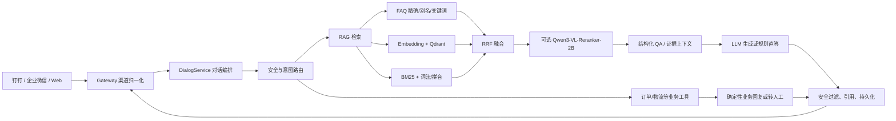

# 智能客服主流框架对比与当前系统优化评审

评审日期：2026-08-13  
评审对象：`feisheng-bot` 当前代码、运行配置、离线评测结果，以及《框架对比.md》  
评审边界：本文以仓库和已有评测文件为依据；生产环境中的数据库模型配置、流量比例和外部平台状态仍需在线核验。

## 一、结论先行

当前系统已经具备主流智能客服的核心技术骨架：多渠道接入、FAQ 精确匹配、向量检索、BM25、词法/拼音召回、RRF 融合、Cross-Encoder 重排、结构化 QA、安全边界、人工转接、业务查询工具和离线评测。它不是需要推倒重来的“简单知识库问答系统”。

真正的短板主要在工程化和运营闭环，而不是缺少某个框架名称：

1. **P0：端到端延迟偏高且波动大。** 真实业务第二轮评测 20 条样本平均 `7,375 ms`、P95 `12,381 ms`、最大 `22,992 ms`；可疑样本复测 12 条平均 `5,808 ms`、P95 `24,722 ms`。
2. **P0：Reranker 运行阈值与代码/Compose 默认值存在漂移风险。** 当前工作区实际配置较宽松，不能直接把模型分数当成通用置信度。
3. **P0：缺少线上可观测性和自动回归门禁。** 目前主要依赖日志、后台接口和数据库记录，尚未形成统一的 P50/P95/P99、分阶段耗时、错误率和告警体系。
4. **P1：业务 API 已有实现，但默认关闭且生产治理不完整。** 订单/物流工具已经存在，下一步应扩展为受权限、超时、熔断、脱敏保护的统一工具层，而不是把实时数据全部写入 RAG。
5. **P1：知识、FAQ、意图和别名模型仍需统一。** FAQ 完整问句别名链路已有修复，但关键词字段仍承担多种语义，容易造成漏命中或误直答。
6. **P1：Bad Case、CSAT 和人工审核尚未形成自动闭环。** 系统能收集未命中问题，也有 CSAT 字段，但低评分、错误引用、答案遗漏、延迟超 SLO 等还没有自动进入修复队列。

因此，**当前不建议为了“对齐主流”立即迁移到 LangChain/LlamaIndex，也不建议现在全面拆成多 Agent。** 先把延迟、阈值、数据权限和线上反馈闭环做好，收益会高于更换编排框架。

## 二、对比表的事实校正

| 维度 | 《框架对比.md》的判断 | 当前系统核验结果 | 正确结论 |
|---|---|---|---|
| 架构 | 自研 RAG、多路召回、RRF、Rerank | `RagRetrievalService` 已串联 FAQ、向量、BM25、词法、拼音、RRF 和可选 Rerank | **基本对齐**；需要优化并行度、阈值和观测 |
| 知识源 | 只有文档+FAQ，缺 API/数据库 | 已有 `BusinessToolOrchestrator`、订单/物流工具、本地数据源和外部 HTTP Provider；`BUSINESS_API_ENABLED` 默认关闭 | **能力已有，生产接入不足** |
| 意图层 | FAQ 别名未打通 | `IntentService` 已参与对话路由；FAQ 控制器已有显式完整问句别名匹配 | **不能再按“缺失”处理**；需要统一数据模型和冲突优先级 |
| 语音 | 未看到 ASR/TTS | 已有 ASR、TTS、钉钉音频处理代码；TTS 默认关闭，电话级实时打断链路尚未完成 | **文字客服无需立即投入；电话场景需专项建设** |
| 多 Agent | 当前单 Agent | 目前是模块化单体 + `CustomerServiceTool` 策略工具路由，不是完整多 Agent | **当前规模可接受**；业务流程明显分叉后再拆分 |
| 评测运营 | 缺在线 A/B、Bad Case、CSAT 闭环 | 已有离线 RAG/对话评测、未命中问题和 CSAT 字段 | **离线能力较好，线上闭环不足** |
| 延迟 | 主流 P95 < 3 秒 | 真实业务样本 P95 12.381 秒；复测 P95 24.722 秒 | **当前最大差距，列为 P0** |
| 成本 | 简单问题规则直答，复杂问题调用 LLM | 精确 FAQ、结构化 QA 可直答，但中低置信度问题仍可能进入 LLM；Query Expansion 默认关闭 | **有降本基础，需要建立模型路由和成本指标** |

## 三、当前系统技术形态



部署形态是 Java 17 + Spring Boot 3.2.4 的模块化单体，包含 `common`、`knowledge`、`core`、`gateway`、`admin`，由 Admin 应用统一启动；数据和基础设施包括 MySQL、Redis、Qdrant、MinIO，前端为 Vue 3 + Element Plus + Vite。

这个形态的优点是边界清楚、部署简单、容易做确定性规则和事务控制。缺点是所有检索和模型调用都在同一请求链路内，若没有阶段级并行、超时预算和观测，单个慢依赖会直接放大用户感知延迟。

## 四、优化清单

### P0-1：建立延迟预算并优化检索链路

**问题证据**

- 当前实现对查询变体逐个调用 Embedding/Qdrant，BM25 和词法召回也按阶段顺序执行；“多路召回”不等于“并行召回”。
- Reranker 最多处理 10 个候选，但仍位于 LLM 之前；外部模型、Embedding 和 LLM 任一阶段超时都会推高总耗时。
- 评测中存在 12 秒和 22 秒以上的长尾。

**建议实现**

1. 为请求设置总预算，例如首期 6 秒，后续再向 3 秒靠近。
2. FAQ 精确命中、业务工具命中、结构化 QA 直答继续绕过 LLM。
3. 原始查询的 Embedding、BM25、词法召回并行；扩展查询只在必要时执行。
4. 只对低置信度或候选存在竞争的问题调用 Reranker；FAQ 高置信命中不重排。
5. 缓存 Embedding、FAQ 精确结果和短期稳定的检索结果，并设置知识版本作为缓存键的一部分。
6. LLM 使用流式输出或先发送渠道可接受的处理中状态，避免用户一直等待空白。
7. 对每个阶段记录 `latency_ms`：渠道接入、意图、安全、Embedding、Qdrant、BM25、Rerank、LLM、出站发送。

**首期验收指标**

- 文本客服 P95 `<= 6 秒`，P99 `<= 10 秒`；稳定后再挑战 P95 `<= 3 秒`。
- Reranker 超时/失败率 `< 1%`，且失败时仍能正确走融合结果。
- FAQ/业务工具/结构化直答占比和平均耗时可按渠道、意图查询。

### P0-2：重新标定 Reranker，并统一配置来源

当前代码默认值、Compose 默认值、环境变量和数据库模型配置可能不一致。Reranker 的高/中置信阈值必须以当前模型、当前候选文本格式和当前业务评测集重新标定，不能直接照搬其他模型的分数。

重点记录并分析：

- `top1` 分数、`top2` 分数、`top1-top2 gap`；
- 正确命中、错误直答、拒答和转人工；
- FAQ、文档、结构化 QA 各自的分数分布；
- Reranker 不可用时的降级结果。

建议将配置收敛到一个明确优先级：数据库发布配置 > 环境变量 > 代码默认值，并在启动时打印“非敏感配置快照”和配置版本。对线上灰度先采用保守策略：宁可让中低置信问题进入澄清/转人工，也不要让竞争候选直接生成答案。

### P0-3：补齐线上观测和自动门禁

建议接入 Spring Boot Actuator、Micrometer、Prometheus/Grafana，并为一次问答生成统一 `traceId`。最低指标集包括：

- 请求量、渠道量、并发量和错误率；
- P50/P95/P99 总延迟及各阶段延迟；
- FAQ 精确命中率、向量召回率、Reranker 可用率/降级率；
- LLM 调用率、Token、估算成本；
- 无答案率、低置信回答率、转人工率、CSAT；
- 引用覆盖率、引用与答案冲突数、PII 拦截数；
- Qdrant 健康、索引同步延迟、Embedding 版本不一致数。

将这些指标接入发布门禁：评测集回归失败、P95 超 SLO、PII 泄漏或错误直答率超阈值时，禁止扩大灰度。

### P1-1：把业务 API 做成生产级工具层

当前订单/物流工具已经具备意图识别、订单号补全、归属校验、审计和失败转人工等基础能力。下一步建议统一工具协议，扩展合同、账户、套餐、工单等查询：

```text
意图识别 -> 参数提取 -> 身份/主体校验 -> API 调用
         -> 超时/重试/熔断 -> 脱敏 -> 确定性回复或转人工
```

必须具备：连接和读取超时、有限重试、熔断、请求幂等标识、用户与业务主体匹配、敏感字段脱敏、审计日志和明确降级。实时订单状态不应定期灌入 RAG 作为长期事实。

### P1-2：统一意图、FAQ、别名和回答策略模型

建议将当前混合字段逐步拆为：

```text
canonical_question   标准问题
question_aliases     完整等价问列表
recall_keywords      短关键词列表
intent_code           意图编码
answer_policy         直答 / 检索 / 工具 / 转人工
knowledge_version     生效知识版本
```

这样可以避免短关键词触发错误直答、FAQ 与意图规则相互竞争、空格/逗号/换行格式导致漏命中，以及同一意图维护多条互相冲突的 FAQ。

### P1-3：Query Expansion 采用小流量、定向灰度

QueryExpansionService 当前默认关闭，且实现已对精确命中、长问题、业务工具问题、字面量和订单号等场景主动跳过，属于保守设计。建议沿用“小问题 + 未命中/低置信”策略：

- 先按 10% 灰度，只处理短问题且原始召回为空或置信度低的问题；
- 每个问题最多增加 2～3 个变体，保留原问题第一优先级；
- 保留原意、否定、数字、产品名和实体校验；
- 运行 3～5 天，比较命中率、错误命中率、平均/P95 延迟、LLM 成本和转人工率；
- 只有在“有效命中提升、错误直答不升、延迟可控”同时满足时再扩大比例。

### P1-4：建立 Bad Case + CSAT 闭环

自动进入待处理队列的条件应包括：

- 用户低评分或负面反馈；
- 已回答但引用错误、答案遗漏或事实冲突；
- 低置信度直接回答；
- 延迟超过 SLO；
- 转人工失败、业务工具异常或 Reranker 降级；
- PII/安全规则触发。

每条 Bad Case 应保留问题、回答、引用、候选、模型/Prompt/知识版本、耗时和人工结论，并能一键加入固定回归集。目标不是只增加日志，而是形成“发现 -> 标注 -> 修复 -> 评测 -> 灰度 -> 复盘”的闭环。

### P1-5：补齐知识权限和发布治理

当前已有 `sourceScope` 和文档审核/发布流程，但仍需确认是否存在租户、角色、部门或客户可见范围 ACL。内部文档不能仅靠文件名、Prompt 或单一 scope 隔离；发布到客服索引前必须完成权限校验，引用和日志也应按同一权限策略保护。

### P2：按业务复杂度决定多 Agent 和语音

**多 Agent：** 暂时保留现有模块化单体和工具路由。只有当售前、售后、投诉、合同审核拥有明显不同的工具权限、状态机、Prompt 和维护团队时，再拆成独立 Agent 或独立服务。否则会增加上下文传递、追踪和故障定位成本。

**语音：** 钉钉/企业微信文字客服无需为了对齐主流而启用 TTS。若目标变为电话客服，需单独建设流式 ASR、TTS、打断、通话状态机、音频超时和录音合规；这不是简单打开 `TTS_ENABLED` 就能完成的能力。

## 五、是否需要更换主流框架

### 当前建议：不迁移，先治理自研 RAG

现有系统已经有稳定的 Java/Spring 事务边界、渠道适配、权限、安全规则、工具审计和评测接口。迁移到 LangChain/LlamaIndex 等框架不会自动解决延迟、阈值、数据 ACL 或 Bad Case 闭环，还会引入：

- Java 与 Python/TypeScript 生态混用成本；
- 现有 DTO、事务、鉴权和渠道链路重写；
- 新框架抽象层带来的调试和版本升级成本；
- 线上行为与当前评测基线不可直接比较。

如果未来需要统一模型供应商、工具调用和流式协议，可以先评估 Spring AI 作为局部适配层，但不建议以“更换框架”作为当前优化目标。当前应优先把检索接口、工具接口、评测 trace 和配置中心做成稳定契约。

## 六、90 天落地路线

| 时间 | 重点工作 | 交付物 | 退出条件 |
|---|---|---|---|
| 第 1～2 周 | 阶段耗时埋点、Reranker 阈值校准、配置来源盘点 | 延迟看板、阈值报告、配置清单 | 能定位一次请求的主要耗时和配置版本 |
| 第 3～4 周 | FAQ/意图/别名字段治理；FAQ、工具、结构化 QA 路由优化 | 数据迁移脚本、冲突优先级、回归集 | 错误直答率下降，FAQ 命中不回退 |
| 第 5～6 周 | 并行召回、短期缓存、Reranker 条件调用、总超时预算 | 检索性能版本 | P95 降到 6 秒以内，降级不影响可用性 |
| 第 7～8 周 | 业务 API 工具层生产化、ACL 和脱敏核验 | 工具 SDK/契约、审计和熔断 | 业务主体校验和失败转人工可验证 |
| 第 9～10 周 | Bad Case、CSAT、引用和低置信回答自动入队 | 运营队列、人工审核页、回归集 | 低评分能关联到完整 trace |
| 第 11～12 周 | Query Expansion 10% 灰度；按指标决定是否扩大 | 灰度报告、回滚开关 | 命中提升且错误、延迟、成本不恶化 |
| 第 13 周 | 评估是否需要多 Agent/实时语音 | 架构决策记录 | 只有出现明确业务边界和收益时才立项 |

## 七、建议的最终验收指标

| 类别 | 首期目标 | 稳定期目标 |
|---|---:|---:|
| 决策准确率 | `>= 97%` | `>= 98%` |
| 知识依据一致率 | `>= 97%` | `>= 98%` |
| 必要事实命中率 | `>= 90%` | `>= 95%` |
| PII 泄漏 | `0` | `0` |
| 错误直答率 | `< 2%` | `< 1%` |
| 文本客服 P95 | `<= 6s` | `<= 3s`（视模型和渠道能力） |
| Reranker 失败率 | `< 1%` | `< 0.5%` |
| 低评分 Bad Case 自动入队 | `>= 95%` | `>= 99%` |
| 工具主体校验覆盖率 | `100%` | `100%` |

## 八、依据文件

- [框架对比.md](C:/Users/HQJ/Desktop/框架对比.md)
- [当前架构扫描摘要](../outputs/architecture-scan-summary.md)
- [RAG 系统技术梳理](rag-system-architecture-review-2026-08-12.md)
- [真实业务第二轮评测](evaluation-results/dianqian-real-business-round2-20260812-171711.json)
- [真实业务可疑样本复测](evaluation-results/dianqian-real-business-round2-retest-20260812-172004.json)
- [业务查询工具说明](customer-service-phase-3-business-tools-2026-07-17.md)
- [语音转写说明](rag-phase-4.md)
- `feisheng-bot-parent/feisheng-bot-core/src/main/java/com/feisheng/bot/core/service/impl/RagRetrievalService.java`
- `feisheng-bot-parent/feisheng-bot-core/src/main/java/com/feisheng/bot/core/service/QueryExpansionService.java`
- `feisheng-bot-parent/feisheng-bot-core/src/main/java/com/feisheng/bot/core/service/RerankService.java`

