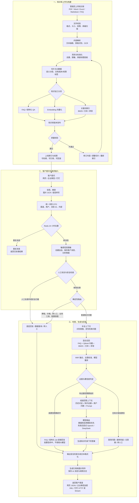

# 智能客服端到端流程架构图

本文描述智能客服从管理员上传知识库，到客户提出问题，再到系统生成并回传回答的完整流程。

## 流程要点

- 知识库内容需经过解析、清洗、切片、索引和质量校验后，才能发布给智能客服检索使用。
- 客户消息先统一接入，并完成去重、脱敏、安全检查与确定性路由。
- 普通知识问题使用混合检索与置信度判断；高置信 FAQ 可直接回答，其余由大模型基于知识证据生成答案。
- 最终回复统一经过安全检查、引用生成和日志记录，再按客户所在渠道回传。
